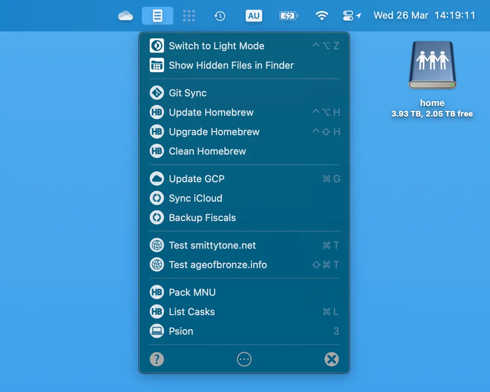

# MNU 2.1.1 #

For usage and other information, please see [the MNU web site](https://smittytone.net/mnu/index.html).

### Development Scripts ###

Run `mnuprep.sh` from the `Scripts` folder to prep in-app menu and popover graphics. Source: one or more large-size masters (PNGs or JPEGs).

The script `postinstall.sh` is used to kill an existing app instance after re-installation.

### Building the App ###

Items in the Xcode project-view folder `YOU MUST SUPPLY` are proprietary and not included in this repo. To build the code, you must either replace these items with your own (app icon, menu bar icon, menu item images, menu item selection images and other visual assets) or comment out the code that makes use of them.

## Release Notes ##

See [CHANGELOG.md](./CHANGELOG.md)

## Copyright ##

MNU is copyright &copy; 2025, Tony Smith.

## Licence ##

MNU’s source code is issued under the [MIT Licence](./LICENSE). MNU’s graphics are not included in the source code. However, I do include a selection of custom menu images for users of macOS 26.x and up. Select and these by editing a menu item and choosing a custom image.
